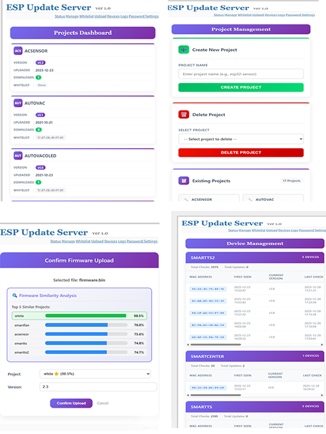

# 🚀 ESP Update Server
**ESP8266 / ESP32 OTA 固件更新服务器**  
**ESP8266 / ESP32 OTA Firmware Update Server**

## 📌 项目简介 | Project Overview


**ESP Update Server** 是一个用于管理 ESP8266 / ESP32 固件升级的 Web 服务器。  
**ESP Update Server** is a lightweight web server used to manage firmware updates for ESP8266 and ESP32 devices.

设备通过 HTTP 请求服务器，服务器根据设备名称和当前版本号判断是否需要更新。  
Devices send HTTP requests to the server, which decides whether an update is required based on device name and firmware version.

适用于局域网 OTA、批量升级、自动化部署等场景。  
Suitable for LAN OTA updates, batch device upgrades, and automated deployment.



## 📌 项目来源 | Project Source

本项目源自 [kstobbe/esp-update-server](https://github.com/kstobbe/esp-update-server)，  
但已进行了全面重写和改进，以支持更灵活的 OTA 更新和 ESP32 / ESP8266 功能。  

This project is based on [kstobbe/esp-update-server](https://github.com/kstobbe/esp-update-server),  
but has been completely rewritten and improved to support more flexible OTA updates for ESP32 and ESP8266.

## ✨ 功能特性 | Features

- ✅ 支持 ESP8266 / ESP32  
  Supports ESP8266 and ESP32
- ✅ 基于 HTTP 的 OTA 升级  
  HTTP-based OTA firmware update
- ✅ 使用设备名 + 版本号进行校验  
  Uses device name and version for validation
- ✅ 支持多项目 / 多固件  
  Supports multiple projects and firmware versions
- ✅ 使用标准 HTTP 状态码  
  Uses standard HTTP response codes
- ✅ 适合内网或私有服务器  
  Suitable for LAN or private server deployment

## 🌐 OTA 请求方式 | OTA Request Format

设备通过以下 URL 请求升级：  
Devices request firmware using the following URL:

```
http://<SERVER_IP>:5002/update?ver=<version>&dev=<device_name>
```

### 示例 | Example

```
http://192.168.1.100:5002/update?ver=v1.0&dev=ProjectName
```

## 📡 服务器返回状态 | Server Response Codes

| HTTP 状态码 | 中文说明               | English Description                |
| ----------- | ---------------------- | ---------------------------------- |
| `200`       | 有新固件可更新         | New firmware available             |
| `304`       | 当前已是最新版本       | Already up to date                 |
| `400`       | 请求参数错误           | Bad request                        |
| `500`       | 服务器错误或设备未授权 | Server error or device not allowed |

## 🔧 ESP32 OTA 示例 | ESP32 OTA Example

```cpp
#include <HTTPClient.h>
#include <HTTPUpdate.h>
#include <WiFi.h>

#define VERSION "v5.7"
#define APP     "ProjectName"

const char *urlBase = "http://<SERVER_IP>:5002/update";

void checkForUpdates()
{
    String checkUrl = String(urlBase);
    checkUrl += "?ver=" + String(VERSION);
    checkUrl += "&dev=" + String(APP);

    Serial.printf("Checking for updates: %s\n", checkUrl.c_str());

    WiFiClient client;
    t_httpUpdate_return ret = httpUpdate.update(client, checkUrl);

    switch (ret)
    {
        case HTTP_UPDATE_FAILED:
            Serial.printf("Update failed: %s\n",
                          httpUpdate.getLastErrorString().c_str());
            break;

        case HTTP_UPDATE_NO_UPDATES:
            Serial.println("Already on latest version");
            break;

        case HTTP_UPDATE_OK:
            Serial.println("Update successful, rebooting...");
            break;
    }
}
```

## 🔧 ESP8266 OTA 示例 | ESP8266 OTA Example

```cpp
#include <ESP8266HTTPClient.h>
#include <ESP8266httpUpdate.h>
#include <ESP8266WiFi.h>

#define VERSION "v5.7"
#define APP_NAME "ProjectName"

const char* OTA_UPDATE_URL = "http://<SERVER_IP>:5002/update";

void checkForFirmwareUpdate()
{
    String updateUrl = String(OTA_UPDATE_URL);
    updateUrl += "?ver=" + String(VERSION);
    updateUrl += "&dev=" + String(APP_NAME);

    WiFiClient client;
    t_httpUpdate_return result = ESPhttpUpdate.update(client, updateUrl);

    switch (result)
    {
        case HTTP_UPDATE_FAILED:
            // 更新失败 / Update failed
            break;

        case HTTP_UPDATE_NO_UPDATES:
            // 已是最新版本 / Already up to date
            break;

        case HTTP_UPDATE_OK:
            // 更新成功，设备将自动重启
            // Update successful, device will reboot
            break;
    }
}
```
